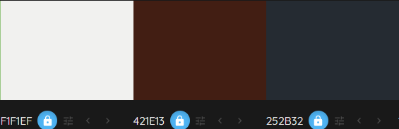
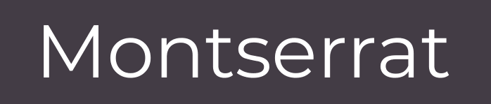
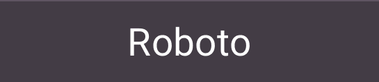
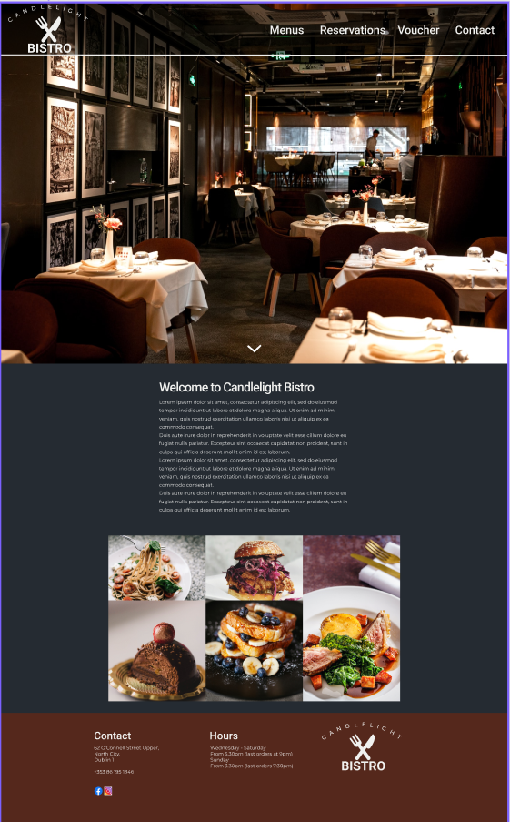
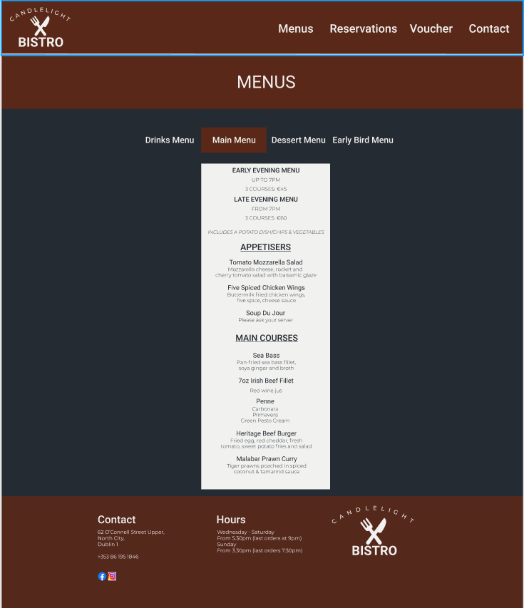
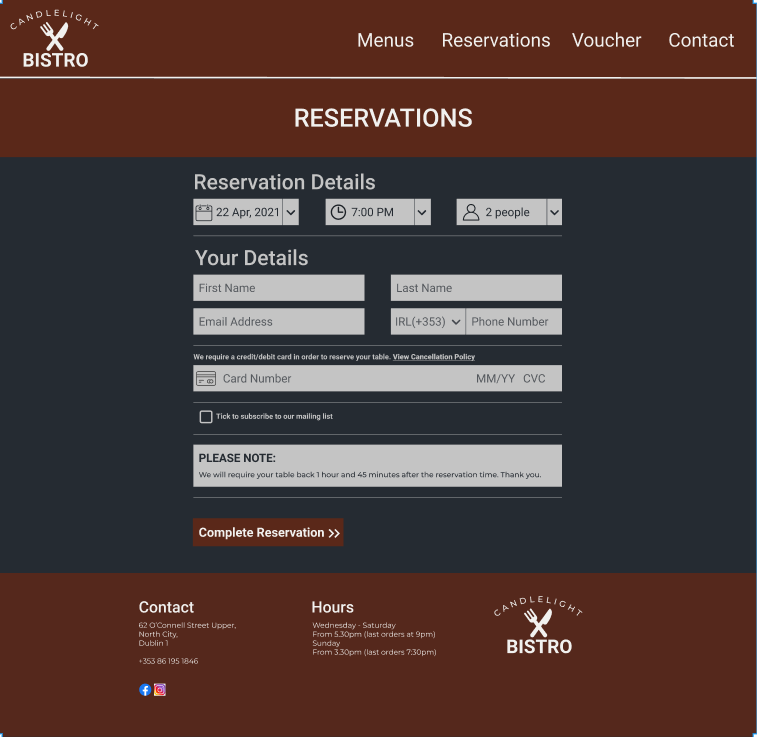
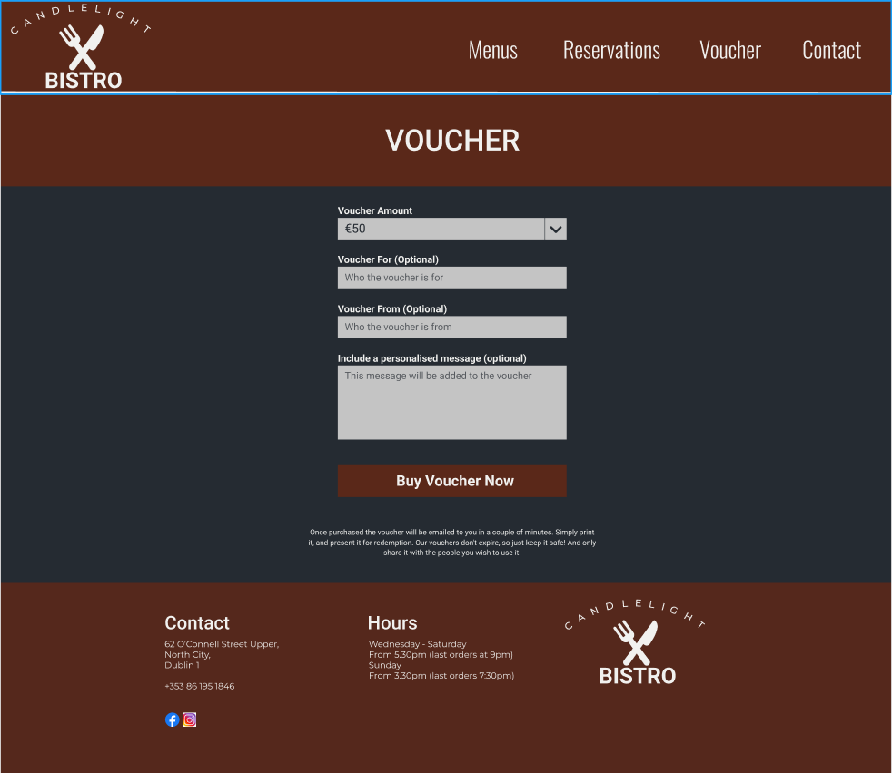
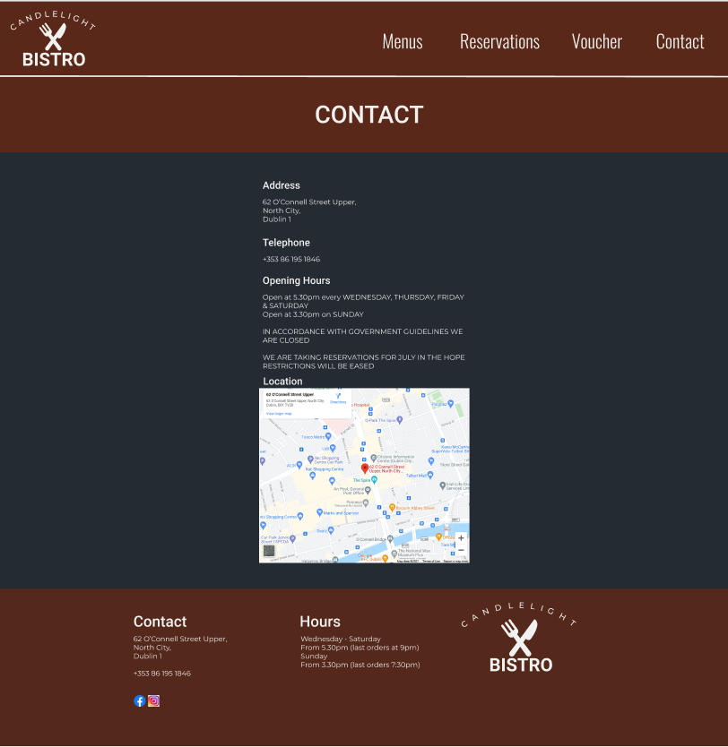

# Portfolio Project 1 - Candlelight Bistro
---
Live Website
GitHub Repository
## About
---
This website is for a ficticious Dublin-based restaurant. It offers an intimate atmosphere and quality food. It includes all the features you would expect a website of this kind to have. It's both usable and responsive while still looking elegant.
##Table of Contents
---
## User Experience (UX)
---
### User Stories
* As any visitor to the website
  1. I want to easily understand the purpose of the website at first glance.
  2. I want the flow of information and interaction feedback to be clear and unambiguous.

* As a prospective patron of the restaurant
  1. I want to be able to view all the choices of food and drink.
  2. I want to know where the restaurant is located.
  3. I want to know the contact information for the business should I need it.
  4. I want to be able to make a reservation.
  5. I want to know about any logistical details such as dress code or cancellation policy.

* As someone wanting to treat friends or family to dinner
  1. I want to be able to purchase a voucher for them
  2. I want to be able to personalise it and choose where it is delivered.

* As a returning/regular visitor to this website
  1. I want to be able to access and use this website from any one of my devices.
  2. I want the ability to navigate between pages to be readily accessible at all times.

### Design
* Colour Scheme
  * As one of the main goals of this website is to convey a sense of the elegant and intimate atmosphere of the restaurant I wanted to keep the colour scheme simple, and towards the warmer side of the spectrum. When I was in the design phase I came across an image that I decided would work well as the hero image and I match the rest of my colours accordingly. I only used 3 main colours throughout the website. An off-white (#F1F1EF), and dark navy (#252B32) and a warm brown (#421E13). These colour choices allowed for high contrast while not being as bland to the user as simple black and white.
  
    

* Typography
  * The main font I used is a sans-serif font called Montserrat with sans-serif as the backup. It's easy to read and has a sleek look that fits nicely with the asthetic I wanted to give the website.
  
  * The secondary font I used for headings and titles was Roboto which is a bolder font, helping it to be more impactful.
  

* Imagery
  * Images on this website need to entice the viewer and help convert their visit into a booking for the business. At the same time I had to make sure that the pictures didn't clash with the colour scheme. I kept the images to the home page because they are a big driving force behind such a sale. Doing so made each of the other pages more utilitarian but allows the advantage of a more consistent design across the pages. I used royalty free images on this website.

* Mockups
  * I created desktop mockups of the website in Figma. For the tablet and mobile views I simply condensed the content to suit. In hindsight, better preparation at this stage would have helped a great deal as I often found myself pondering over how best to convert the desktop page  into a mobile friendly version.

  
  
  
  
  

## Features
---
### Common Features Across All Pages
* Header - allows user to easily navigate across all pages
  * The header is designed to be visible at the top of the page at all times using a fixed position so the user is never lost.
  * The restaurant's logo is located in the top left and doubles as the link to the home page from any other page on the website.
  * On desktop the navigation links are underlined on hover by the user.
  * The current page will remain underlined in the nav bar on desktop.
  * The nav bar is compressed into a hamburger button on smaller devices which opens a modal menu when clicked.
* Accessibility
  * All images have alt attributes to allow the visually impaired to appreciate the spirit of each section.
* Responsiveness
  * All pages are responsive across a wide range of devices regardless of viewport size.
* Footer
  * Footer has been coded to be sticky at the bottom of the page. This is expected in modern design and anything else would be jarring to the user.
  * The footer content is spaced out symmetrically and stacks upon itself when the viewport sizes is smaller than a certain breakpoint.
  * Social media icons increase in size when hovered over and open in a new tab so as not to ferry the user away from the website.

### Specific to Pages
* Index Page
  * Hero image that sets the scene inside the restaurant, allowing the user to imagine the atmosphere on site.
  * A brief description of what market the restaurant aims to cater to, along with a gentle notice of the dress code.
  * Gallery of some of the dishes served further enhancing the users ability to picture the experience.
* Menu Page
  * Interactive menu cards that appear and disappear depending on whether they are targetted or not.
* Reservations
  * A reservation form that allows user to make a booking online.
  * The form has validation criteria to prevent erroneous inputs.
* Voucher
  * A form that allows users to purchase a voucher for the restaurant.
* Contact
  * All the neccessary information for anyone wishing to visit or contact the restaurant.
  * A Google Maps iframe which shows the precise location of the establishment.

## Technologies Used
---
### Languages Used
* HTML5
* CSS3

### Libraries and Programs Used
* Font Awesome - Used to add social media icons along with other icons across the website.
* Google Fonts - Used to import "Montserrat" and "Roboto" fonts to the stylesheet.
* Git - Used to allow for the tracking of code changes and version control.
* GitHub - Used to host the files and publish the live version on Git Pages.
* GitPod - Connected to GitHub, provided the Integrated Development Environment and allowed for the code to be saved to the GitHub repository.
* Figma - Used to create the mockups of the website.
* TinyJPG - Used to lower image resolution to decrease load times.

## Testing
---
